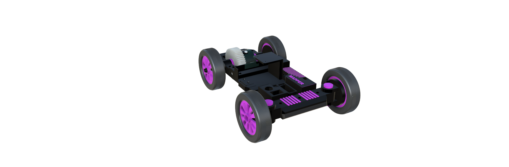
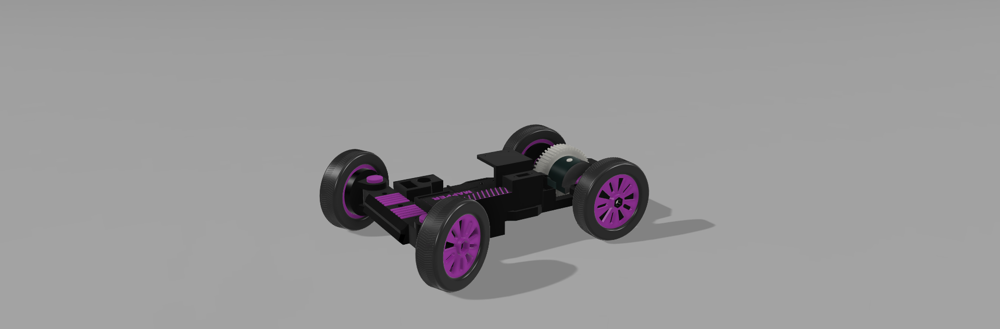
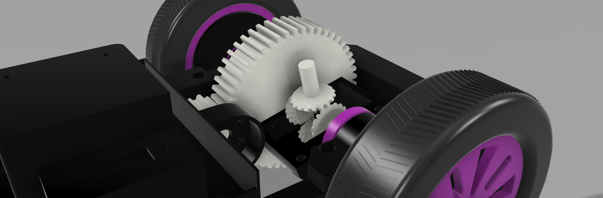
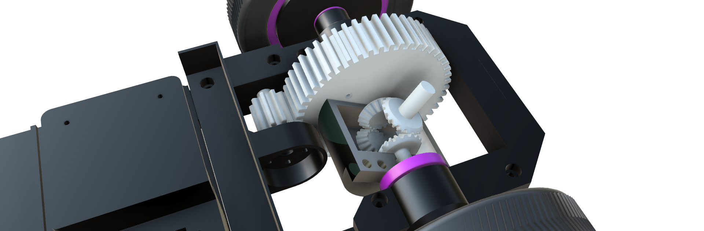

# MAPPER — 3D Chassis Design

3D-printed chassis for the MAPPER autonomous racing platform, designed in Fusion 360.



## Highlights

- **Ackermann steering** geometry on front axle
- **Gear-driven rear differential** with spur gear reduction
- **Modular mounting points** for electronics (Jetson, VESC, LiDAR, camera)
- Black body with purple accent livery

## Design Evolution

The chassis went through 13 iterations, from bare rolling platform to a fully featured race-ready body.

| Version | Preview | Changes |
|---------|---------|---------|
| v1 |  | Initial rolling chassis with gear drive |
| v5 |  | Rear gearbox close-up — spur gear reduction |
| v7 |  | Refined body with component mounting bays |
| v10 |  | Gearbox detail — worm-to-spur gear mesh |
| v13 |  | Final top-down view with MAPPER branding |

All 13 version renders are in the [`images/`](images/) folder.

## Video

> **TODO:** Add YouTube link here
<!-- https://www.youtube.com/watch?v=XXXXX -->

## CAD Source

- [`Mapper-final1.f3z`](Mapper-final1.f3z) — Fusion 360 archive (22 MB). Open with [Autodesk Fusion](https://www.autodesk.com/products/fusion-360/).

## Files

```
docs/3d-mapper/
├── README.md
├── Mapper-final1.f3z      # Fusion 360 source
└── images/
    ├── v1.png … v13.png   # Design iteration renders
```
